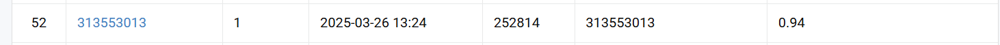

# Homework 1: Image Classification  
**Student ID :** 313553013  
**Name :** 李品妤  

## 📝 Introduction

This homework tackles a **100-class image classification task** using deep learning methods.  
Use this dataset https://drive.google.com/file/d/1fx4Z6xl5b6r4UFkBrn5l0oPEIagZxQ5u/view
The dataset includes RGB images of plants and insects, divided into:

- **Train**: 20,724 images  
- **Validation**: 300 images  
- **Test**: 2,344 images


We explore the following techniques to enhance model performance:
- Transfer Learning (ResNet101, ResNet152, ResNeXt-50)
- Data Augmentation
- Mixup 
- Test-Time Augmentation (TTA)
- Learning rate scheduling (CosineAnnealingLR, ReduceLROnPlateau, OneCycleLR)
- Ensemble (Hard Voting)

---

##  ⚙️ How to install

Make sure you have Python 3.8+ installed.

Install dependencies using pip:


### 1. Clone the repository

```bash
git clone https://github.com/Pinpunyu/NYCU_Visual_Recognition.git
cd NYCU_Visual_Recognition
```

### 2. Environment Setup

```bash
pip install -r requirements.txt
```

### 3. To run the notebook:

```bash
jupyter notebook HW1.ipynb
```

If you're using **Visual Studio Code**, make sure you install the following extensions:

- **Python**
- **Jupyter**

Once installed, simply open `HW1.ipynb` in VS Code and you can run each cell interactively just like in Jupyter Notebook.

---

## 📊 Performance snapshot



