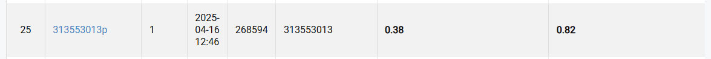

# Homework 2: Digit Recognition 
**Student ID :** 313553013  
**Name :** 李品妤  

##  Introduction

This homework focuses on digit recognition tasks within the Street View House Numbers (SVHN) Dataset.We address two primary objectives: (1) localizing and classifying each digit in an image and (2) reconstructing the complete multi-digit sequence from those detections.

- **Train**: 30,062  images  
- **Validation**: 3,340 images  
- **Test**: 13,068 images


We explore the following techniques to enhance model performance:
- Base Faster-RCNN Different backbone 
- Adjusting Anchor Sizes
- Modifying Trainable Backbone Layers

---

##   How to install

Make sure you have Python 3.8+ installed.

Install dependencies using pip:


### 1. Clone the repository

```bash
git clone https://github.com/Pinpunyu/NYCU_Visual_Recognition.git
cd NYCU_Visual_Recognition/HW2
```

### 2.  Environment Setup

```bash
pip install -r requirements.txt
```

### 3.  Run training and testing:

```bash
python main.py
```

### 4.  Run testing:

```bash
python test.py --checkpoint "model_path"
```

---

##  Performance snapshot



