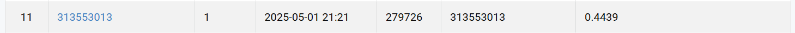

# Homework 3: Instance Segmentation 
**Student ID :** 313553013  
**Name :** 李品妤  

##  Introduction

This homework focuses on a **nuclei instance segmentation** task. The dataset provided by the TA includes 209 images for training and validation, and 101 images for testing.

We build upon **Mask R-CNN** using the `maskrcnn_resnet50_fpn_v2` backbone from Torchvision and explore several techniques to enhance model performance:

- Use simple data augumentation(colorjitter)
- Adjusting Anchor Sizes
- Modifying Trainable Backbone Layers
- Test-Time Augmentation and Non-Maximum Suppression
- Ensemble

---

##   How to install

Make sure you have Python 3.8+ installed.

Install dependencies using pip:


### 1. Clone the repository

```bash
git clone https://github.com/Pinpunyu/NYCU_Visual_Recognition.git
cd NYCU_Visual_Recognition/HW3
```

### 2.  Environment Setup

```bash
pip install -r requirements.txt
```

### 3.  Run training and testing:

```bash
bash run.sh
```

### 4.  Run testing only (using a saved model):

```bash
bash test.sh
```

### 5. Run ensemble:

```bash
python ensemble_predict.py   --data-root ./datasets   --weights-list model1.pth model2.pth  --save-path test-results.json   --out-dir ./outputs
```

---

##  Performance snapshot



